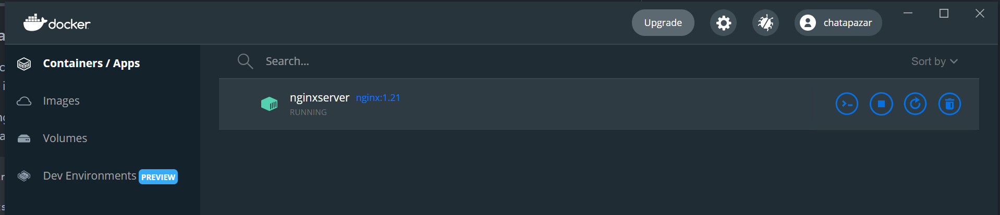

# Prerequisite for Windows Machine

- Switch to Linux container before start lab
- for docker for windows, if 'ctrl + c' don't work for close terminal, you can stop interactive docker with menu on docker dashboard
  

- for test bind mount to physical path in windows, create path in your machine with below command
  ```bash
  #go to cd $HOME
  $ cd $HOME
  #create folder mypgdata
  $ mkdir mypgdata
  ```
